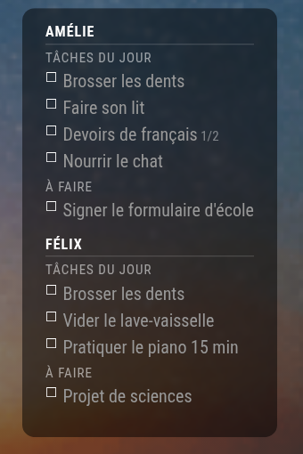

# MMM-HabiticaChores

A [MagicMirror²](https://magicmirror.builders) module that shows outstanding
**[Habitica](https://habitica.com)** chores — the **dailies due today** and
**open to-dos** — for one or more family members, as a glanceable, read-only
checklist. Turn the mirror into a "chores on the wall" board.

> Unlike [`MMM-HabiticaStats`](https://github.com/delightedCrow/MMM-HabiticaStats),
> which shows only a player's level / HP / XP, this module renders the actual
> **task list**.

<p align="center">
  
</p>

## Features

- **Dailies due today** (`isDue` and not completed) + **open to-dos**, per person.
- **Multiple users** — each family member with their own User ID + API token.
- **Optional stat line** (`showStats`) — class · level · ❤ HP · ⭐ XP · 🪙 gold, plus
  today's completion (`✓ 2/4`), all localizable and computed with Habitica's own
  formulas (no extra library). Requests are staggered to respect the rate limit.
- **Three view modes** (`mode`): a detailed `list` (chores per person); a compact
  horizontal `summary` (each person's **composited Habitica avatar sprite** +
  today's completion `2/4`); and `stats` (per-player cards — big avatar, HP/XP
  bars, gold, completion). Pair them across a multi-page mirror (glance on the
  home page, detail + full stats on others).
- **Checklist progress** badge (e.g. `1/2`) for tasks with sub-items.
- **Shared node_helper cache** — multiple instances (summary + detail + stats)
  trigger one set of API calls, not several. Cache entries are keyed by API base
  and de-duplicated while in flight.
- **Fails soft** — if a refresh fails (network blip, server restart), the last
  known chores stay on screen (dimmed) instead of blanking the board.
- **Read-only & safe** — never modifies your tasks; the mirror just reflects
  Habitica, refreshing on a timer. (As with any authenticated Habitica client,
  a fetch after a user's day rollover triggers their server-side cron — i.e.
  the day rolls over on first contact.)
- **Keep your MagicMirror port on the LAN**: API tokens live in `config.js` and
  are handed to the module's helper, as with any credentialed MM module.
- **Demo mode** — preview the layout with canned data, no account required.
- **Optional panel** — a translucent card so text stays readable over a photo
  background.

## Install

```bash
cd ~/MagicMirror/modules
git clone https://github.com/KrZ-W/MMM-HabiticaChores.git
```

No `npm install` needed — it uses Node's built-in `fetch` (Node 18+).

## Configuration

Add to the `modules` array in `~/MagicMirror/config/config.js`:

```js
{
  module: "MMM-HabiticaChores",
  position: "top_left",
  config: {
    users: [
      { name: "Amélie", userId: "xxxxxxxx-....", apiToken: "yyyyyyyy-...." },
      { name: "Félix",  userId: "xxxxxxxx-....", apiToken: "yyyyyyyy-...." }
    ],
    panel: true
  }
}
```

Get each person's **User ID** and **API token** from
**Habitica → Settings → Site Data**. The API token is like a password — keep it
out of any public place (including GitHub); it belongs only in your local
`config.js`.

### Options

| Option | Type | Default | Description |
|---|---|---|---|
| `users` | array | `[]` | `{ name, userId, apiToken }` per person. |
| `apiBase` | string | `""` | Point at a **self-hosted** Habitica (e.g. `"http://host:3000/api/v3"`). Blank = `habitica.com`. |
| `group` | object | `null` | `{ name, id, userId, apiToken }` → render a party's **group/shared chores** as a 🏠 section (open chore, marked done ✓ by whoever completes it). Needs a Group Plan (free when self-hosted). |
| `mode` | string | `"list"` | `"list"` (detailed chores), `"summary"` (avatar + completion strip), or `"stats"` (per-player stat cards). |
| `columns` | int | `1` | List mode: `>1` lays out person cards in a grid instead of one stack. |
| `showDifficulty` | bool | `false` | List mode: show per-task difficulty pips (◆ = reward level: easy/medium/hard). |
| `showDailies` | bool | `true` | Show the "dailies due today" section. |
| `showTodos` | bool | `true` | Show the "to-dos" section. |
| `onlyDueToday` | bool | `true` | Dailies: only those scheduled for today. |
| `hideCompleted` | bool | `true` | Hide chores already completed. |
| `maxPerUser` | int | `0` | Cap items shown per person (`0` = no cap). |
| `panel` | bool | `false` | Draw a translucent card behind the list. |
| `showStats` | bool | `false` | Show a per-user stat line (class/level/HP/XP/gold + today's completion). |
| `demo` | bool | `false` | Render canned sample chores (no account). |
| `showUserHeader` | bool | `true` | Show each person's name as a header. |
| `updateInterval` | int | `900000` | Refresh interval, ms (default 15 min). |
| `cacheSeconds` | int | `240` | node_helper cache TTL. Lower = more "live" (safe on self-host; keep high on cloud for the rate limit). |
| `reqGapMs` | int | `500` | Delay between API requests. Lower for self-host (no rate limit). |
| `dailiesLabel` | string | `"Tâches du jour"` | Label for the dailies section. |
| `todosLabel` | string | `"À faire"` | Label for the to-dos section. |
| `emptyText` | string | `"Tout est fait 🎉"` | Shown when a person has nothing left. |

A `users[]` entry may set `stats: false` to skip the stat line for that account
(handy for a shared "household" bucket where level/XP is meaningless).

## Two pages on one mirror

Chores don't have to crowd your main layout. Pair this with
[`MMM-pages`](https://github.com/edward-shen/MMM-pages) to auto-rotate between
your normal dashboard (page 0) and a dedicated chores page (page 1), leaving the
first page untouched:

```js
{
  module: "MMM-pages",
  config: {
    modules: [
      ["clock", "calendar", "weather", "newsfeed"], // page 0
      ["MMM-HabiticaChores"]                          // page 1
    ],
    fixed: ["MMM-page-indicator"],
    timings: { default: 20000 } // 20 s per page
  }
}
```

## Test your credentials without MagicMirror

```bash
HABITICA_USER=<userId> HABITICA_TOKEN=<apiToken> node test-api.js
```

Prints the task counts and the outstanding dailies / to-dos the module would
show. Run the parsing unit test with `npm test`.

## Tip: pictograms for pre-readers

Habitica has no per-task icon field, but you can put an emoji at the **start of
the task name** in Habitica itself (e.g. `🪥 Brosser ses dents`). It then shows
both on the mirror *and* in the Habitica app where kids check chores off — handy
for children who can't read yet. Install a color-emoji font on the display
(`fonts-noto-color-emoji`) so they render.

## How a "chore" is defined

- A Habitica **Daily** that is **due today** (`isDue`) and **not yet completed**.
- Plus open **To-Dos** (`completed === false`), soonest due first.
- **Habits** and **Rewards** are ignored.

Completing chores is done in the Habitica app (phone/web); the mirror reflects
the new state on the next refresh. Habitica's rate limit is 30 requests/min per
user — the default 15-minute refresh is far under it.

## License

[MIT](LICENSE) © KrZ-W

Not affiliated with or endorsed by Habitica. "Habitica" is a trademark of its
respective owners.
